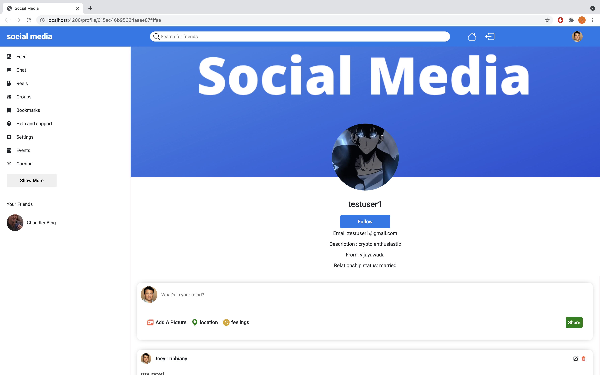
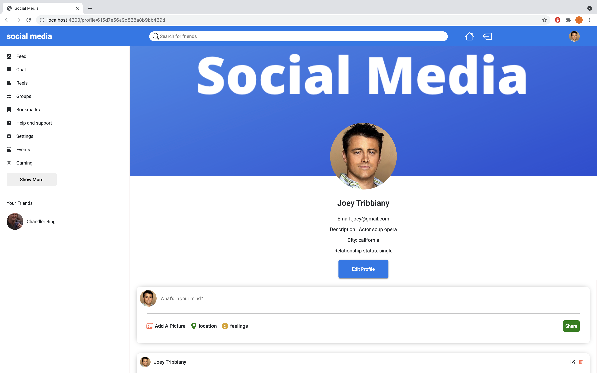

# Mean-Stack-Social-Media
A Mean Stack Social Media Application with JWT authentication. You can post text and images, follow other users and like their posts. You can edit and delete your posts. you can edit your profile  info.

view http://ec2-3-12-198-6.us-east-2.compute.amazonaws.com/

### Tech Stack
1) NodeJs
2) ExpressJs
3) MongoDb
4) Angular 12

### Requirements
[Intsall Node Js](https://nodejs.org/en/)
check nodejs and npm versions by typing the below command
```bash
> node -v
```
```bash
> npm -v
```
[Install angular cli](https://angular.io/cli)
check your angular version by typing the below command
```bash
> ng --version
```
- clone the repo or unzip it to a folder
command to clone the repository
```bash
> git clone https://github.com/kowsikgelli/Mean-Stack-Social-Media.git
```
- open terminal at this folder
there will be two folders one is angular-frontend and other is backend
angular-frontend contains all the angular frontend code and backend contains all the nodejs backend code
open two terminals in frontend and backend folders
```bash
> cd angular-frontend
```
```bash
> cd backend
```
now install dependencies in both terminals with the below command
```bash
> npm install
```
the above command will install all the dependencies present in your package.json file
- now open terminal in backend folder and create .env file with the below command
```bash
> touch .env
```
open the file with a text editor and add these environment variables
```bash
PORT = 5000
ATLAS_URI = 'your mongodb atlas url'
JWT_SECRET = 'random secret value you can give anything here'
JWT_EXPIRE = 7d
CLOUDINARY_CLOUD_NAME = 'your cloudinary name'
CLOUDINARY_API_KEY = 'your cloudinary api key'
CLOUDINARY_API_SECRET = 'your cloudinary secret'
```
- [create mongodb atlas](https://www.mongodb.com/cloud)
if you dont know how to get connection uri [watch this video](https://www.youtube.com/watch?v=Ej05tq1220A&ab_channel=MongoDB)
- [create cloudinary account](https://cloudinary.com/)
cloudinary provides a cloud-based image and video management services (it has a free tier that you can use).
After creating account you can see the CLOUDINARY_CLOUD_NAME, CLOUDINARY_API_KEY, CLOUDINARY_API_SECRET in the dashboard copy those and paste it in your .env file
now all the environment variables are set. lets run the code.
- To run the backend open terminal in the backend folder and type the below command.
```bash
> node server.js
```
- To run our angular frontend open terminal in angular-frontend folder and type the below command.
```bash
> ng serve
```
it will your angular app in port 4200. open http://localhost:4200 in the browser


1) once opened link in browser it will navigate to login page. If you have already registered you can login or you can directly login with google.


2) after logged in you will see a home page like this.


in your case ypu may not have any posts or friends.

3) You can create a post by typing something in what's in your mind coloumn and upload a picture buy clicking Add A Picture and click share button to create a post

your post will be automatically added to the feed.


The Enjoying nature text and selected photo will be added in the feed like this


4) you can update and delete your posts. you can find the edit and delete icons on top right of a post.


5) you can see your friends in the left side bar and you can see people you may know on the right side bar. If you click any of these you can see their profile you can follow and unfollow them. The friedns list in left side bar are the people you are following. Once followed the person will be added to your friend list you can see their posts in your feed and you can like them.

this is how their profile page looks like



6) You can see your profile by clicking profile icon on top right of navbar.



7) you can edit your profile by clicking edit profile button and To upload a profile picture click on the circle and choose a photo to upload.


will add new features in future :smiley: 

